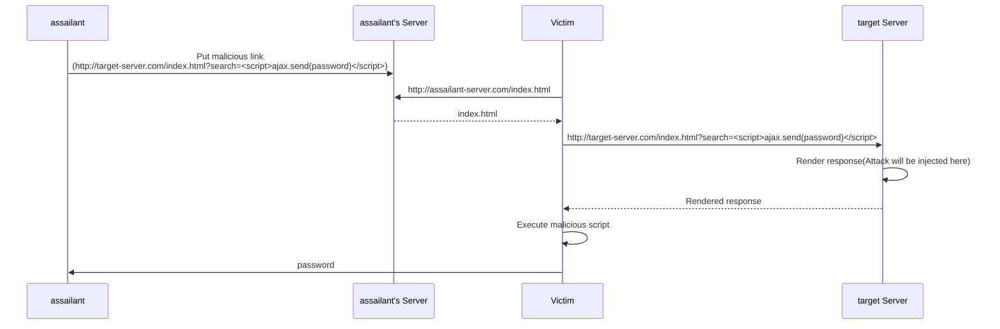
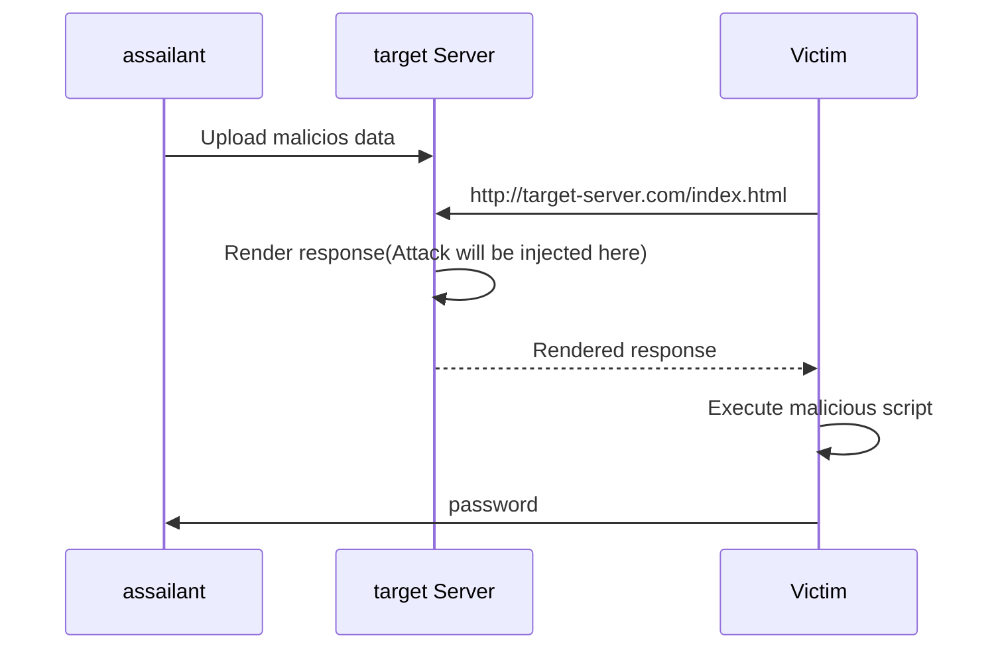
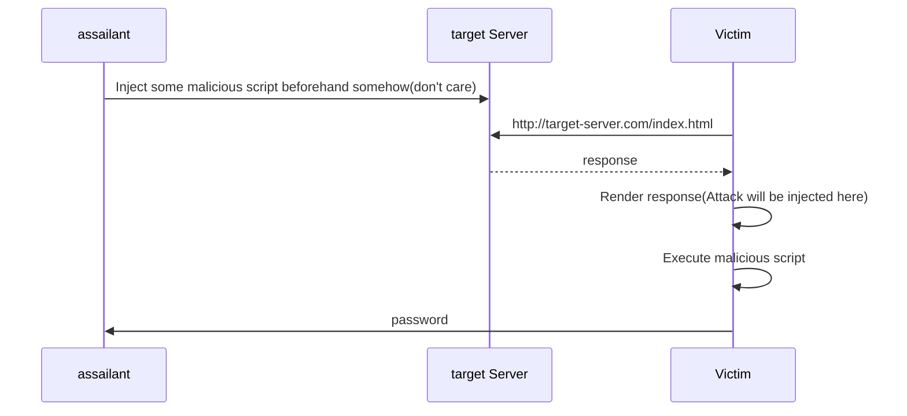

# xss-demo
Demonstrate XSS attack

https://yamamichid.github.io/xss-demo/

## XSS
XSS(Cross-Site Scripting) has three generally recognized forms of XSS:
* Reflected XSS
* Stored XSS
* DOM Based XSS

And they are also categorized to two categories by **where the attack is injected**.
* Server-side XSS
  * Reflected XSS
  * Stored XSS
* Client-side XSS
  * DOM Based XSS

### Relected XSS

### Stored XSS

### DOM based XSS

## References
* https://cheatsheetseries.owasp.org/cheatsheets/DOM_based_XSS_Prevention_Cheat_Sheet.html#:~:text=The%20primary%20difference%20is%20where%20the%20attack%20is,XSS%20is%20a%20client%20%28browser%29%20side%20injection%20issue.
